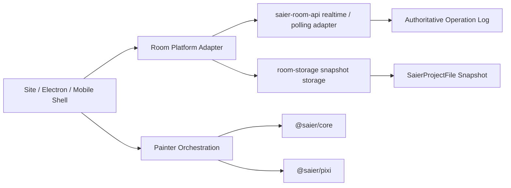
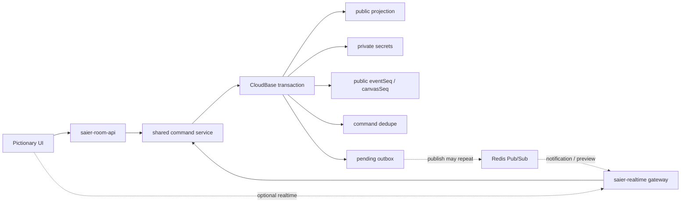

# 云端房间共享画布

云端房间是 P13 的协作子系统。它复用现有 painter core、工程文件、[stroke recording / replay](./stroke-recording) 和 YunLeFun 账号体系，但不把协作逻辑塞进 `@saier/core`。第一版目标是“房间共享观看 + 房主 committed 绘制同步”，再逐步把低延迟 preview 和 owner 管理 UI 做成增强项。

## Goals

- 通过房间链接共享当前画布，加入者能加载当前快照。
- 房主提交绘制后，加入者能按服务端 revision 看到一致的最终像素状态。
- 所有持久化修改进入服务端排序的 operation log。
- 断线重连能从最近 snapshot + 增量 ops 恢复。
- 多人编辑后续以权限、图层锁、服务端顺序为边界演进。

## Non-Goals

- 不做像素级 CRDT。
- P13 v1 不要求专用 realtime 后端；先用 `saier-room-api` polling + heartbeat 验证正确性。
- 不让 `@saier/core`、`@saier/pixi`、`@saier/vue` 依赖 YunLeFun / CloudBase / WebSocket。
- 不在第一版支持离线多人合并。
- 不保证不同 brush engine 版本之间无限期 deterministic replay；版本不一致时以 snapshot 重新对齐。

## Architecture



平台差异只在 room platform adapter：

- Web：YunLeFun SSO + CloudBase / `saier-room-api`。
- Electron：同一 Web UI shell，后续可通过 preload adapter 处理本地文件和窗口能力。
- Capacitor/Ionic：同一 mobile shell，后续可通过 native bridge 处理分享、状态栏、安全区。

## Room Model

```ts
export interface SaierCloudRoom {
  id: string
  ownerUserId: string
  title: string
  visibility: 'link' | 'private'
  mode: 'viewer' | 'driver' | 'multi-editor'
  createdAt: number
  updatedAt: number
  headRevision: number
  latestSnapshotRevision: number
}

export interface SaierCloudRoomMember {
  roomId: string
  userId: string
  role: 'owner' | 'editor' | 'viewer'
  joinedAt: number
  lastSeenAt: number
  online: boolean
  presence?: Record<string, unknown>
}
```

第一版默认：

- owner 可以编辑。
- viewer 只能观看和发送 presence。
- driver 模式允许 owner 把编辑权临时交给一个成员。
- multi-editor 模式由服务端角色 / mode 权限和 revision 串行 replay 支撑；owner 管理 UI 作为后续增强。

## Operation Envelope

所有持久化操作都经过服务端排序。客户端发送 `clientOpId + baseRevision`，服务端分配单调递增 `revision` 后广播。

```ts
export interface SaierRoomOperation<TPayload = unknown> {
  roomId: string
  revision: number
  clientOpId: string
  clientId: string
  userId: string
  baseRevision: number
  type: SaierRoomOperationType
  payload: TPayload
  createdAt: number
}

export type SaierRoomOperationType
  = | 'stroke:start'
    | 'stroke:append'
    | 'stroke:commit'
    | 'document:command'
    | 'layer:command'
    | 'project:snapshot'
```

`stroke:start` / `stroke:append` 可以作为低延迟 preview 广播；真正进入持久日志的是 `stroke:commit`。如果网络或版本不一致导致 preview 与 commit 不一致，以 commit replay 或后续 snapshot 为准。

## Stroke Commit Payload

```ts
export type SaierRoomStrokeCommit = SaierStrokeCommit
```

约束：

- 坐标为 document space。
- `events` 复用 [`saier.stroke.v1`](./stroke-recording#stroke-schema) 的时间归一策略。
- `brushPresetSnapshot` 固化 commit 时的参数，避免后续用户改 preset 后回放变样。
- `brushEngine id/version` 固化 commit 时的 engine，缺失或不兼容时不得静默 fallback。
- smudge / water / sampler 类笔刷必须严格按服务端 revision replay。
- `patchHash` 用于调试和一致性检查，不作为 v1 的主要同步内容。

## Command Payloads

`document:command` 和 `layer:command` 只同步可重放的语义命令，不同步 UI 临时状态。

示例：

```json
{
  "type": "layer:command",
  "payload": {
    "command": "layer:add",
    "args": {
      "id": "layer_2",
      "label": "Layer 2",
      "index": 1
    }
  }
}
```

需要锁或确认的高风险命令：

- `document:resize`
- `document:clear`
- `document:import-project`
- `layer:remove`
- `layer:merge`
- `layer:move-node`

## Snapshots

Snapshot 是 `SaierProjectFile`，存入 shared storage 或 room 专用 storage。Room log 只保存 snapshot 元信息：

```ts
export interface SaierRoomSnapshotRef {
  roomId: string
  revision: number
  storageKey: string
  fileId: string
  sizeBytes: number
  createdAt: number
}
```

策略：

- 创建房间时上传初始 snapshot。
- 每 N 个持久化 ops 或超过固定时间窗口后生成新 snapshot。
- 客户端加入：下载最近 snapshot，再拉取 `revision > snapshotRevision` 的 ops。
- 如果客户端落后太多或 log 被压缩，强制重新下载最新 snapshot。

Snapshot 的作用不是截图预览，而是某个 room revision 的完整工程基线：

- 新加入者不需要从 room 创建开始 replay 全量 operation log，只需导入最新 snapshot，再 replay 之后的增量 ops。
- 断线重连时，如果本地 `lastAppliedRevision` 早于 `latestSnapshotRevision`，客户端直接重新下载 snapshot，避免对已压缩或过长的 log 做不可靠回放。
- `patchHash` / 像素 hash 校验失败时，snapshot 是重新对齐的恢复点；语义 stroke replay 与 committed patch fallback 都以它作为一致性锚点。
- 长房间可以通过 checkpoint snapshot 控制恢复时间和 storage 成本，旧 ops 可归档或压缩，不影响新客户端加入。

## Room API Contract

P13 前端以 CloudBase Event Function `saier-room-api` 为唯一房间后端入口，不直接读写房间集合或跨用户 storage key。线上已有 YunLeFun `room-api` 用于非 Saier shared spaces，Saier 协作必须使用独立函数名，避免互相污染。

仓库已提供 `cloudbase/functions/saier-room-api` 源码和 handler 单测。2026-07-08 已在 `yunlefun-8g7ybcxc7345c490` 创建 `saier_room_*` 集合、应用 client-deny security rules，并部署 `saier-room-api` Event Function；管理态调用确认函数能加载并拒绝未登录请求。同日已用 `ylf_test_saier_owner` + `ylf_test_saier_viewer` 跑通第一条真实浏览器 smoke：owner 创建房间，viewer 通过 invite link 只读加入并导入初始 snapshot。

### `createRoomSnapshotUpload`

客户端发送：

```json
{
  "action": "createRoomSnapshotUpload",
  "appId": "saier",
  "contentType": "application/json",
  "fileName": "name.saier.room-snapshot.json",
  "format": "saier.project",
  "mode": "viewer",
  "sizeBytes": 12345,
  "title": "name",
  "visibility": "link"
}
```

服务端创建 pending room、校验用户和大小限制、预留 room snapshot storage，返回：

```ts
interface CreateRoomSnapshotUploadResult {
  room: SaierCloudRoom
  upload: {
    fileName: string
    reservationId: string
    storageKey: string
  }
  inviteToken?: string
  maxBytes?: number
  shareUrl?: string
}
```

浏览器随后用 CloudBase `uploadFile` 上传到 `upload.storageKey`。

### `finalizeRoomSnapshotUpload`

客户端发送：

```json
{
  "action": "finalizeRoomSnapshotUpload",
  "roomId": "room_id",
  "reservationId": "reservation_id",
  "storageKey": "room-storage-key",
  "fileId": "cloud-file-id",
  "sizeBytes": 12345
}
```

服务端校验 pending reservation 与 file id，创建 revision `0` snapshot，并返回 `session`：

```ts
interface RoomSessionResult {
  session: {
    room: SaierCloudRoom
    members: SaierCloudRoomMember[]
    role: 'owner' | 'editor' | 'viewer'
    readOnly: boolean
    inviteToken?: string
    shareUrl: string
  }
}
```

### `finalizeRoomSnapshotText`

小 snapshot 可走函数侧上传 fallback。客户端仍应优先使用 `createRoomSnapshotUpload` 返回的 `upload.storageKey` 调 CloudBase browser SDK `uploadFile`；当 storage CUSTOM write rule 尚未开放或浏览器上传被拒绝，且 snapshot <= 4 MiB 时，可以把 snapshot 文本交给云函数：

```json
{
  "action": "finalizeRoomSnapshotText",
  "roomId": "room_id",
  "reservationId": "reservation_id",
  "storageKey": "room-storage-key",
  "sizeBytes": 12345,
  "text": "{...SaierProjectFile...}"
}
```

服务端用 Node SDK 上传 `fileContent`，再走与 `finalizeRoomSnapshotUpload` 相同的 reservation 校验和 revision `0` snapshot 创建逻辑。这个 fallback 只用于小文件 smoke 和早期生产兼容；大 snapshot 仍需要 storage CUSTOM rule 正常放行或后续签名上传方案。

### `joinRoom`

客户端发送：

```json
{
  "action": "joinRoom",
  "roomId": "room_id",
  "inviteToken": "optional_token"
}
```

服务端按 `visibility` / membership / invite token 授权，返回 session 和 snapshot：

```ts
interface JoinRoomResult {
  session: RoomSessionResult['session']
  snapshot: {
    text?: string
    downloadUrl?: string
    maxBytes?: number
  }
}
```

`snapshot.text` 适合小文件；大文件必须返回后端签名 `downloadUrl`。前端只接受 `SaierProjectFile`，并以只读模式导入。

### `appendOperation`

客户端发送：

```json
{
  "action": "appendOperation",
  "roomId": "room_id",
  "clientId": "browser_tab_id",
  "clientOpId": "uuid",
  "baseRevision": 0,
  "type": "stroke:commit",
  "payload": {}
}
```

服务端校验 membership / role / room mode，按 `baseRevision === room.headRevision` 分配 `revision = headRevision + 1`，并以 `roomId + clientOpId` 幂等去重。重复提交同一 `clientOpId` 返回既有 operation，不重复写入。

### `listOperations`

客户端发送：

```json
{
  "action": "listOperations",
  "roomId": "room_id",
  "afterRevision": 0,
  "limit": 200
}
```

服务端返回按 revision 升序排列的 ops。P13-02 的实时 transport 先用 polling 验证，再替换成 CloudBase realtime / WebSocket。

当前 site data plane 使用 committed tile patch payload：

```json
{
  "schema": "saier.room.stroke-patch.v1",
  "patch": {
    "schema": "saier.room.stroke-patch.v1",
    "layerId": "layer-id",
    "rect": { "x": 0, "y": 0, "width": 16, "height": 16 },
    "tiles": [
      { "layerId": "layer-id", "tileX": 0, "tileY": 0, "after": "base64" }
    ]
  },
  "patchHash": "fnv1a"
}
```

这比语义 stroke replay 更重，但能在 painter 尚未暴露 per-instance stroke recorder 前保证 smudge / watercolor / sampler 类笔刷的观看端像素一致性。后续补齐 [Stroke Recording](./stroke-recording) 的 runtime recorder 后，可保持 `appendOperation` contract 不变，把 `stroke:commit` payload 切到 `SaierStrokeCommit`；tile patch 继续作为 replay drift / engine mismatch 的 fallback。

### `createSnapshotUpload` / `finalizeSnapshotUpload` / `finalizeSnapshotText`

checkpoint snapshot 复用初始 snapshot 的 reserve / upload / finalize 状态机，但目标 revision 是当前 `room.headRevision`。`finalizeSnapshotUpload` 更新 `latestSnapshotRevision`，加入和重连时从该 revision 继续拉增量 ops。

P13 v1 前端在可写 session 中按固定 op 数和固定时间窗口自动创建 checkpoint：

- `CHECKPOINT_OP_INTERVAL = 25`
- `CHECKPOINT_TIME_WINDOW_MS = 5min`

浏览器 storage 上传失败且 snapshot <= 4 MiB 时，checkpoint 也可以使用 `finalizeSnapshotText` 让云函数通过 Node SDK 上传文本内容；大 snapshot 仍依赖 storage CUSTOM rule 或后续签名上传方案。

### `setMemberRole` / `setRoomMode`

owner 可以把成员设为 viewer / editor，并切换 `viewer`、`driver`、`multi-editor` 模式。`driver` 模式下只有 `driverUserId` 指向的 editor 可以提交写 op；`multi-editor` 模式允许 editor 提交 op，但仍由服务端 revision 串行化。

## Reconnect

客户端维护：

- `roomId`
- `clientId`
- `lastAppliedRevision`
- pending `clientOpId` map

重连流程：

1. 重新认证 YunLeFun 用户。
2. 读取 room head 和 latest snapshot。
3. 如果 `lastAppliedRevision >= latestSnapshotRevision`，拉取增量 ops。
4. 否则下载 latest snapshot，再拉取其后的 ops。
5. 对 pending `clientOpId` 做幂等确认；服务端已接收的 op 不重复应用。

## Presence

Presence 是临时状态，不进入持久 log：

- 光标位置。
- 当前视口。
- 当前工具。
- 用户在线 / 离线。

Presence 丢失不影响工程状态。

P13 v1 已接入 `updatePresence` heartbeat：前端周期性上报当前工具、active layer 和 active document，服务端更新 `saier_room_members.lastSeenAt` / `online` / `presence`，并返回最新成员列表。正在画的 stroke ghost preview 仍属于后续 realtime transport 优化；最终像素状态以服务端排序后的 committed patch operation 为准。

## Security

- 房间操作必须通过 YunLeFun auth。
- 服务端校验 room membership 和 role。
- 所有写操作校验 `baseRevision` 和权限。
- 分享链接只暴露 room id / invite token，不暴露 storage key。
- snapshot download 仍通过服务端签名 URL 或权限校验接口获取。

## Verification

- 双客户端 e2e：A 创建房间，B 加入，B 能看到初始 snapshot。
- A 绘制一笔，B 在固定时间内看到相同 revision。
- A 执行图层命令，B 图层树一致。
- A 断线重连后不会重复应用自己的 pending op。
- B 无编辑权限时不能提交 stroke / layer command。
- snapshot + ops 恢复后像素 hash 与房主一致。
- smudge / water 类笔刷在同一 op 顺序下 replay 一致。
- 真实 smoke teardown 使用 `pnpm cleanup:yunlefun-test-data -- --confirm` 清理 `Saier smoke ` 房间和 `room-storage/saier/{roomId}/`；用户云文件和 quota 只有在专门测试 P10 云同步时才加 `--include-user-storage --reset-quotas`。

## Authoritative Room Activities（P13-07 / P14）

普通共享工程继续使用 room `revision + snapshot` 协议；Pictionary 等临时玩法使用独立 Activity authority。两者共享 room membership 和认证，但不共享画布 repository、operation collection 或 storage namespace。



### Room pointer and compatibility

Room permission mode is named `collaborationMode`; one compatibility window reads `collaborationMode ?? mode` and dual-writes both fields. Activity pointer changes increment `roomMetadataRevision` without changing main-project `headRevision`:

```ts
interface ActiveActivity {
  type: 'pictionary'
  sessionId: string
  activityEpoch: number
  protocolVersion: 1
  status: 'lobby' | 'running' | 'ending'
}
```

Activation and cleanup conditionally match `sessionId + activityEpoch`. Rematch creates a new session and epoch, so an old socket, scheduler or cleanup task cannot affect the new game.

### Transaction and recovery contract

Every deterministic command record uses `(sessionId, userId, commandId)`. Same id/same payload returns the first result; same id/different SHA-256 payload hash fails with `COMMAND_ID_REUSED`. A command transaction reads membership and current fencing state, runs the pure reducer with injected clock/random/id sources, then writes projection, secret/private revision, public events, dedupe result and pending outbox together.

Only lobby configuration, start, choose, manual end and ownership/activity changes use `expectedGameRevision`. Guesses and strokes validate the current `activityEpoch + roundId + phaseEpoch`; strokes additionally validate `controllerEpoch + strokeId` and receive a transactional `canvasSeq`.

Recovery cursor is `roomMetadataRevision + lastEventSeq + roundId + lastCanvasSeq + privateProjectionRevision`. The API always returns one of `DELTA`, `SNAPSHOT_REQUIRED`, `SESSION_ENDED` or `RESYNC_REQUIRED`. A 5-second realtime watermark detects a missing final notification. `roundEnded.finalCanvasSeq` prevents reveal until the committed canvas tail has been applied.

Wrong guesses are transient and never enter events, dedupe public results, logs or traces. Candidate words and answers only live in `saier_room_game_secrets` and an authenticated per-user private projection.

### Activity canvas isolation

Pictionary uses a fixed 1024×768 `ActivityDocument` with one raster layer and activity-only Painter controller. Durable operations live in `saier_room_game_canvas_operations`; storage, when needed, is limited to:

```text
room-storage/saier/{roomId}/activities/{activityEpoch}/{sessionId}/
```

Every preview/commit carries session, activity, round and controller fences. The activity package does not export Painter/Pixi/site implementations and restricted-import lint rules reject reverse dependencies. Main-project collaboration ignores `documentScope: 'activity'` events.

The site hosts first-party activities through an explicit manifest registry. `/?activity=pictionary` opens a temporary workspace tab for its create/join lobby and `activityRoom=…` opens a room in the same tab. `SitePainterApplication` and the main Painter stay mounted; switching to a document tab only hides the Activity, while closing the Activity tab unmounts its isolated Painter, polling/realtime transports and shared activity session state. The plugin module remains a named dynamic chunk, excluded from PWA precache, and is not fetched or executed on an ordinary `/` visit. The legacy `/games/pictionary` and `/games/pictionary/[roomId]` routes redirect to this host so existing invitations remain valid.

### Deadline and transport degradation

The session document stores `phase`, `phaseEpoch`, `roundId` and `deadlineAt`. A NoSQL due-session scan submits the same idempotent timeout command even when Redis is unavailable. Redis sorted sets are only an acceleration index and are rebuilt from active sessions after recovery.

Realtime is feature-flagged and optional. Polling remains authoritative through `connecting → realtime → reconnecting → degraded-polling → resyncing → recovered/fatal`. Recovery establishes a subscription barrier, catches up to its watermark, applies buffered higher sequences, then returns to realtime. Disabling any realtime flag does not disable HTTP commands, polling recovery or the NoSQL scheduler.

Detailed delivery status and rollout gates are tracked in [P13-07 / P14](./tasks/P13-07-authoritative-realtime-activities).
