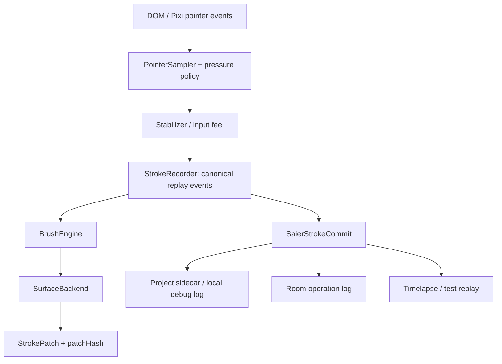

# 笔迹录制与回放设计

笔迹录制不是一个单独的 UI 功能，而是一条底层数据链路：同一份 stroke log 应同时服务于工程文件 sidecar、协作 op log、问题复现、golden-image 测试、教学 / timelapse 回放。像素快照仍是工程文件的主事实来源；笔迹日志是可重放、可调试、可协作同步的语义层。

## Goals

- 记录用户实际落笔产生的 canonical input stream，并能确定性重放到同样像素。
- 支持普通笔刷、橡皮、airbrush 停驻喷涂、smudge / watercolor 等依赖 surface sampler 的笔刷。
- 让本地工程、云端房间和未来 timelapse UI 共用一套 stroke commit payload。
- 允许算法升级后用 snapshot 重新对齐，不要求旧 stroke log 无限期跨版本完全重放。
- 保持 `@saier/core` 无 Pixi / UI / 网络依赖。

## Non-Goals

- 不把 stroke log 作为工程文件唯一真相；工程保存仍必须包含 `SaierProjectFile` 的 tile pixels。
- 不录制 DOM / Pixi 原始事件作为权威数据；它们可作为诊断扩展，但不参与默认回放。
- 不把本地 undo stack 持久化为回放历史；持久日志只记录最终会改变文档状态的 operation。
- 不在 v1 支持离线多人冲突合并或像素级 CRDT。
- 不保证不同 brush engine major version 之间逐像素一致。

## Layering



职责边界：

- `@saier/core`：类型、codec、hash、pure replay helpers、determinism tests。
- `saier` runtime：在 painter 热路径中创建 recorder，捕获 replay events，提交 stroke commit。
- `@saier/pixi`：只负责按 replay 产生的 dab 更新 surface；不持有录制协议。
- `site` / room API：持久化、权限、snapshot checkpoint、presence preview。
- UI：只消费 log 做播放控制，不定义协议。

## Canonical Capture Point

默认录制点位是：**document space、压感归一、稳定器处理之后，调用 `BrushEngine.addPoint()` 之前**。

这样做的原因：

- 不受 zoom、DPR、viewport、DOM/Pixi 事件差异影响。
- 回放时不再跑 `PointerSampler` / `Stabilizer`，避免未来手感算法升级改变旧记录。
- 保留 pressure / tilt / twist / time，仍能驱动速度、压感和笔锋。
- 与现有 `replayShodoStroke()` 的直接 engine replay 模型一致。

原始硬件事件只作为可选 diagnostics：

```ts
export interface SaierRawPointerDiagnostics {
  source: 'dom' | 'pixi'
  coalescedCount?: number
  pointerType?: string
  // No screen coordinates by default; they leak viewport / device details and
  // are not needed for replay.
}
```

## Stroke Schema

公共格式使用 `saier.*` 命名。现有 `ShodoStrokeRecord` / `{X,Y,T,P}` 是兼容 codec 和迁移来源，不作为长期公共 API 名称。

```ts
export const SAIER_STROKE_SCHEMA = 'saier.stroke.v1'
export const SAIER_STROKE_LOG_SCHEMA = 'saier.stroke-log.v1'

export type SaierPaintTarget = 'layer' | 'mask'
export type SaierStrokeTool = 'brush' | 'eraser'

export interface SaierStrokePointEvent {
  kind: 'point'
  /** Stroke-local monotonic time in ms. */
  t: number
  /** Document-space coordinates. */
  x: number
  y: number
  pressure: number
  hasPressure?: boolean
  tiltX?: number
  tiltY?: number
  twist?: number
  pointerType?: 'mouse' | 'pen' | 'touch' | string
}

export interface SaierStrokeTickEvent {
  kind: 'tick'
  /** Stroke-local monotonic time in ms. Used by tickable engines like airbrush. */
  t: number
}

export type SaierStrokeReplayEvent = SaierStrokePointEvent | SaierStrokeTickEvent

export interface SaierBrushEngineSnapshot {
  id: string
  version: string
  capabilities?: string[]
}

export interface SaierStrokeCommit {
  schema: typeof SAIER_STROKE_SCHEMA
  id: string
  documentId?: string
  layerId: string
  paintTarget: SaierPaintTarget
  tool: SaierStrokeTool
  compositeMode: 'normal' | 'erase'
  brushEngine: SaierBrushEngineSnapshot
  brushPresetId: string
  /** Fully resolved preset/options at stroke start. */
  brushPresetSnapshot: unknown
  /** Resolved context handed to `BrushEngine.beginStroke`. */
  brushContextSnapshot: {
    color: { r: number, g: number, b: number, a: number }
    baseSize: number
  }
  /** Seed for any deterministic jitter / paper grain / future procedural tip. */
  seed?: string
  /** `resolved-v1` means events are already post-sampler and post-stabilizer. */
  inputPipeline: 'resolved-v1'
  events: SaierStrokeReplayEvent[]
  result?: {
    dirtyRect: { x: number, y: number, width: number, height: number }
    /** Stable hash of the committed affected pixels or patch. Diagnostic only. */
    patchHash?: string
  }
  metadata?: {
    createdAt?: number
    authorId?: string
    deviceClass?: 'desktop' | 'tablet' | 'mobile'
  }
}
```

Notes:

- `metadata.createdAt` is never used for replay. It is display / audit metadata only.
- `tick` events are required because airbrush can emit dabs while the pointer does not move.
- `brushPresetSnapshot` is mandatory for replay; looking up the user's current preset by id is not enough.
- `brushEngine.version` participates in compatibility checks. A missing or incompatible engine must fail loudly or request a newer snapshot.
- `patchHash` detects divergence; it is not the primary synchronization payload.

## Operation Log

Stroke commits live inside a broader operation log. This is the common shape for local project sidecars and cloud rooms:

```ts
export interface SaierReplayOperation<TPayload = unknown> {
  schema: 'saier.operation.v1'
  opId: string
  /** Local logs can assign this sequentially; rooms use server revisions. */
  revision?: number
  baseRevision?: number
  type:
    | 'stroke:commit'
    | 'document:command'
    | 'layer:command'
    | 'project:snapshot'
    | 'operation:revert'
  payload: TPayload
  createdAt?: number
}

export interface SaierStrokeLog {
  schema: typeof SAIER_STROKE_LOG_SCHEMA
  documentId: string
  baseSnapshot?: {
    schema: 'saier.project-ref.v1'
    revision: number
    url?: string
    embedded?: unknown
    hash?: string
  }
  operations: SaierReplayOperation[]
}
```

`operation:revert` is the persistent form of undo. The local `UndoManager` can keep using `StrokePatch` stacks for responsiveness, but a shared / saved operation log should record an explicit state-changing operation instead of serializing ephemeral undo stack internals.

## Replay Algorithm

Authoritative replay uses tile-backed surfaces. RenderTexture replay can be used for preview, but deterministic verification and sampler-based brushes need CPU tile pixels.

1. Load a `SaierProjectFile` snapshot into a fresh document session.
2. Sort operations by `revision` / local order and apply them exactly once.
3. For `document:command` and `layer:command`, apply semantic commands to the document model.
4. For `stroke:commit`, validate target layer / mask, engine id, engine version, preset snapshot and backend capabilities.
5. Create the brush engine from `brushEngine.id + brushPresetSnapshot`.
6. Call `engine.beginStroke(brushContextSnapshot)` and `backend.beginStroke(layerId)`.
7. Replay events in order:
   - `point`: call `engine.addPoint(point)` directly. Do not run pointer sampling or stabilizer again.
   - `tick`: if the engine is tickable, call `engine.tick(t)`. If it is not tickable and the log contains tick events, fail the commit as incompatible.
8. Paint returned dabs through the same runtime stroke painter used by live drawing, including layer transform mapping, lock alpha, mask target, and smudge sampler interleaving.
9. Call `engine.endStroke()` and `backend.endStroke(layerId)`.
10. Compare `patchHash` when present. On mismatch, mark divergence and request a newer snapshot or apply an explicit patch fallback if the operation carries one.

Smudge / watercolor replay is correct only when previous operations have already been applied in the same order, because sampler results depend on current pixels.

## Project Storage

Best practice is snapshot + append-only log:

- `SaierProjectFile` stores document model and sparse tile pixels.
- `SaierStrokeLog` is an optional sidecar or bundle member.
- Long sessions create checkpoint snapshots and truncate / archive older operations.
- Readers that do not understand stroke logs can still open the pixel snapshot.

Recommended bundle layout for a future packaged project:

```text
project.json              # SaierProjectFile
stroke-log.jsonl          # one SaierReplayOperation per line, optional
assets/                   # future binary tips, refs, thumbnails
manifest.json             # hashes, version, compression metadata
```

For current plain JSON project export, prefer a sidecar over bumping `SaierProjectFile` only to store history. Bump the project version only when the snapshot itself needs new required fields.

## Collaboration

Cloud rooms already use server-authoritative revisions and snapshot checkpoints. Stroke recording changes the data plane, not the room envelope:

- `stroke:start` / `stroke:append` remain ephemeral preview messages or presence events.
- `stroke:commit` becomes a `SaierStrokeCommit` payload when per-instance recorder support exists.
- The current committed tile patch payload remains a valid fallback for exact pixels and for incompatible engines.
- Server revision is the only ordering source. Clients never resolve concurrent strokes locally.
- `patchHash` lets clients detect semantic replay drift and ask for a snapshot.

## Playback UI

Timelapse playback should run in an isolated replay session:

- Load the base snapshot into a throwaway painter instance.
- Apply completed operations immediately or schedule stroke events by `t / speed`.
- Never mutate the user's active editing document during preview.
- Allow skipping to checkpoint snapshots instead of replaying from operation 0.
- For large logs, stream operations in chunks rather than loading the whole file in memory.

## Compression And Privacy

The canonical schema is readable JSON. Storage codecs can be compact without changing semantics:

- Map `point` events to the legacy compact `{X,Y,T,P}` shape or delta-encoded arrays.
- Quantize coordinates only with an explicit tolerance, and keep test fixtures unquantized.
- Use JSONL plus gzip / brotli for large operation logs.
- Strip raw pointer diagnostics from shared rooms by default.
- Treat stroke logs as sensitive: they reveal drawing process, hand movement rhythm, and editing intent.

## Compatibility Policy

- Minor brush engine changes should preserve replay where practical and keep golden tests.
- Major engine changes may break old semantic replay; snapshots remain loadable.
- Missing engine / preset snapshot is a hard error, not a silent fallback.
- If semantic replay diverges and a patch fallback exists, apply the patch and continue with a divergence marker.
- If no fallback exists, request a checkpoint snapshot at or before the failed revision.

## Implementation Plan

1. Promote public names in `packages/core/src/format/`: `SaierStrokeCommit`, `SaierStrokeLog`, codec helpers, and compatibility adapters for `ShodoStrokeRecord`.
2. Add pure replay tests for point events, tick events, smudge sampler order, layer/mask targets, and patch hash mismatch.
3. Add a runtime `StrokeRecorder` in `saier` that starts with live strokes, appends canonical events, records tick events when dabs are emitted, and commits after `SurfaceBackend.endStroke`.
4. Expose `Painter` events or callbacks for `stroke:commit` so site / cloud rooms can persist semantic commits.
5. Keep room tile patch payload as fallback until semantic replay has browser e2e parity.
6. Add optional timelapse UI only after the protocol is stable.

## Acceptance

- Same `SaierStrokeLog` plus same snapshot produces byte-identical tile pixels.
- Airbrush dwell replay matches live output using recorded `tick` events.
- Smudge / watercolor replay matches live output when operations are applied in order.
- Replaying a stroke to a mask target affects mask pixels, not content pixels.
- Missing brush engine or incompatible version fails clearly.
- `patchHash` mismatch is detectable and recoverable through patch fallback or snapshot reload.
